# Colab - Capstone Project by Jason Benjoya

## Live demo: https://www.colab-music.com/

## demo username: testuser; password: testpass

---

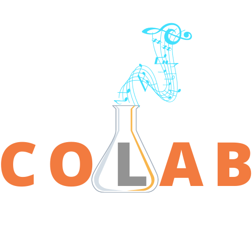

### PROJECT GOALS

Colab is a full-stack web app that marks my second capstone project for the Springboard Software Engineering Career Track Bootcamp, utilitizing an ExpressJS backend with a ReactJS frontend. It includes the following technologies:

- HTML5
- CSS3
- Javascript
- Bootstrap
- AJAX/Axios
- PostgreSQL
- BCrypt
- NodeJS
- ExpressJS
- ReactJS
- Redux
- React-Beautiful-DnD (drag-and-drop)

**Note**: _This is a first version of a student project. Therefore, while there are many features that could be built out further, this app is merely a first step to show my understanding of the technologies at play._

---

### ABOUT THE APP

Colab is, in the simplest terms, a collaborative songwriting suite. The process of cowriting songs was severely shaken during the pandemic, when either extreme in-person caution made it impossible to get any work done, or failing technologies did. Colab provides a one-stop-shop for users to begin the process of writing their next hit.

Although it is not meant to substitute true collaborative songwriting, Colab a place for users to have a common suite in which they can have all of their notes and ideas organized and ready to build out into a fully-imagined production.

---

### FRONT END/USER FLOW

#### <ins>Landing Page</ins>

Full use of all Colab's features does require authentication, so upon arriving at the home page, an unauthenticated user is met with a landing page, which displays previews of what they can find inside the app.

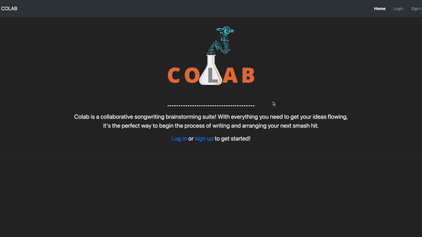

At the bottom of the landing page, as well as in the navigation bar, there are links to login or signup, in order to gain access to all of Colab's features.

#### <ins>Authentication</ins>

A user can log in by clicking on the `Login` button in the top right corner of the Navbar, which will navigate, using client-side routing with React-Router, to the /login route, displaying a login form.

A user can use their registered username/password combo to login and be taken to their dashboard.

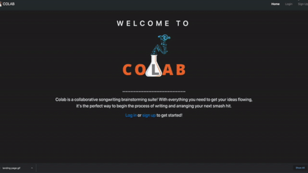

If there are any login errors, such as invalid username or password, a user will be alerted to that directly on the form and will be prompted to login again.

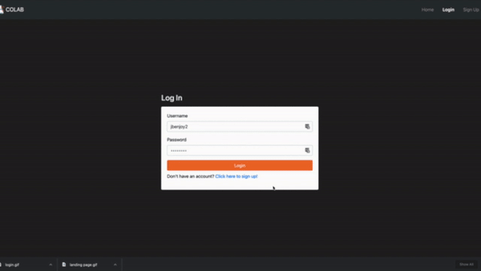

Alternatively, if a user has not previously registered, they can do so by clicking on the `Sign up` button in the top right corner of the navbar, which will navigate to the /register route and display a registration form.

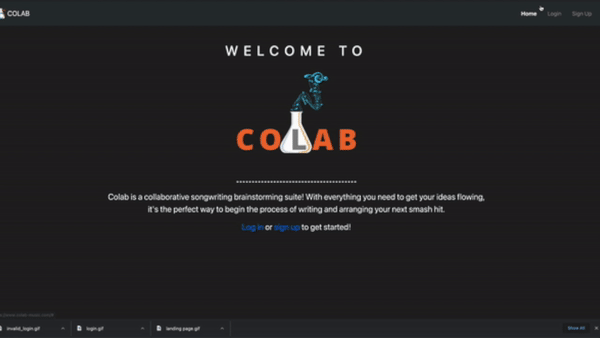

A user can register by supplying all fields, each of which is required. The username AND email must be unique (i.e a user cannot have two usernames associated with the same email, nor can they have two emails for the same username). Successful registration redirects to the user dashboard.

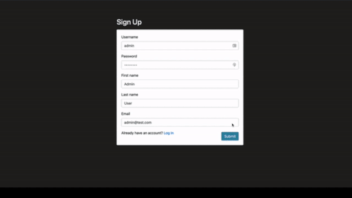

Breaching either of those constraints will prevent successful registration and alert to the user to the problem, prompting them to try again.

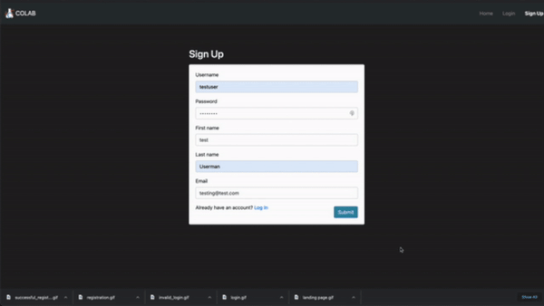

##### `Password Encryption`

All user passwords are salted and encrypted using the BCrypt library before being stored in the database. This provides an added level of security for users, so that they can be assured that nobody else knows their password.

##### `Persisting Login`

Colab uses JWTs to authenticate requests to the backend. Once a user is logged in, they are issued a token. This token is stored in the user's local storage to persist the user between page reloads. Colab also utilizes Redux to store the current user in the app state. Upon login, the proper user corresponding to the JWT is stored in the Redux store, and only gets cleared on logout.

#### <ins>User Dashboard</ins>

Upon authentication, a user is brought to their dashboard. Here they can find a button to create a new project, their own user info, any collaboration requests they have, and a collection of their projects. Projects are separated based on whether the user is the owner (i.e the initial creator of the project).

###### Requests

If a user has a request to collaborate, it will appear in their "Cowrite Requests" panel. Each request displays the sender, as well as the project title and the timestamp at which the request was sent. A user can either reject the request, which simply marks it as answered and, upon page reload, removes it from their requests panel, or accept the request, which will add the project to their "Cowrites" list and give the user access to that project's resources.

_Reject_

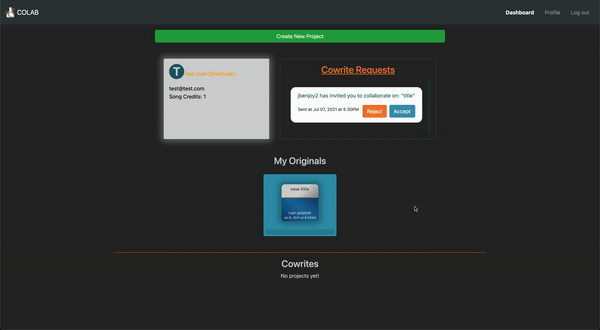
_Accept_

#### <ins>Projects<ins>

##### Creating a New Project

To begin a new project, an authenticated user can click the `Create New Project` button. Upon doing so, a new project will be created with the user listed as the owner, and the user will be navigated to the main project page for that newly created project.

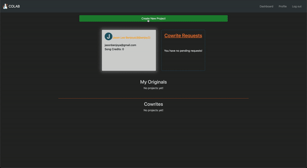

A new project is created with a default title of "Click to Change Title", and the notes are defaulted to be blank. At the bottom of the project page, there is a row of buttons to save the project, leave the project, and delete it from the database (if the user is the project owner).

##### Changing the title

To change the title, a user simply has to click on the current title to trigger the editor. Once in edit mode, a new title can be added in (note that there is a maximum of 25 characters for a project title). A tooltip will also display on hover alerting the user of this click-to-edit functionality.

**Note**: _Submitting the new title does not change the title in the database. To persist the title change, users must click the `Save Project` button at the bottom of the page_

##### Rhymes and Quotes

There are two auxiliary tools found near the top of the project page: the Rhyme tool and the Inspirational Quote tool. Each can be activated by clicking on its corresponding button. The Rhyme Time button utilizes the Datamuse API to search RhymeZone for rhymes that match a given input word. The resulting list shows the words in order of decreasing accuracy according to RhymeZone's scoring algorithm (the RhymeZone score is also included for each result).

Users can utlize the `Random Quote Inspo` tool to generate a random inspirational quote in order to help beat writer's block. The tool utilizes the ZenQuotes API to generate a new random quote each time the user clicks the button.

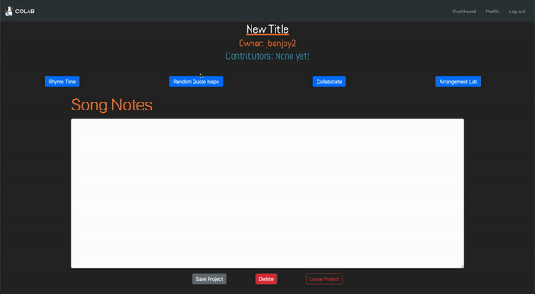

##### Collaboration

Users who are contributors on a given project, whether they are the owner or not, can invite other users to collaborate, as well. By clicking on the `Collaborate` button, a user can search by username for other active users to invite. If the desired user is already a collaborator, or if a request has already been sent to them, they will not be able to request that user again. Instead, the `Request` button will be replaced with a disabled button indicating the status of that user with regards to the current project.

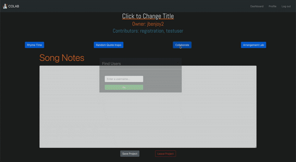

##### Arrangement Lab

The Arrangement Lab tool is where users can brainstorm about how they want their song to flow from section to section. Consisting of drag-and-drop song section tiles, a user can insert and reorder song sections to create their preferred song arrangement for a given project. As they progress through the songwriting process, they can update this arrangement to correspond with any changes they make along the way. These adjustments can including adding, rearranging, and removing sections from the master project arrangement.

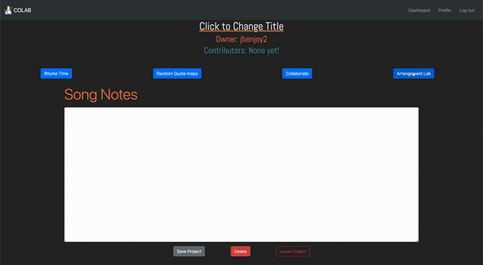

**Note**: _The save button is disabled if there are no items in the Arrangement column. This way a user cannot save an empty arrangement to the database, causing API errors. Changes to the Arrangement column will only persist if the save button is pressed. Otherwise, no changes will persist._

##### Saving/Leaving/Deleting Projects

From the main project page, a user can save all changes made to the project by clicking the `Save Project` button. Without doing so, no changes made to the title or the notes will be stored. Upon saving, a user is alerted to a successful save.

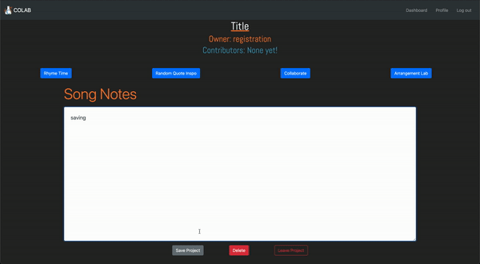

All users are presented with a `Leave` button to leave from a project, and owners are also presented with a `Delete` button, so that they can formally scrap a project from the database. If an owner chooses to leave a project, this action will also delete the project and any contributors will lose access to it. In this sense, owners of a project have pseudo-admin privileges over their original projects.

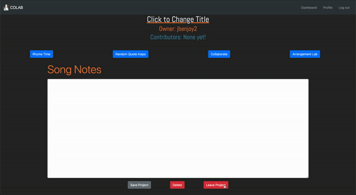
_Owner leaves project_

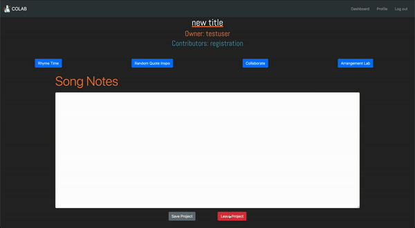
_Contributor leaves project_

_Owner deletes project_

#### <ins>Profile<ins>

A user can edit basic details of their profile including their email address and their first and last name. Doing so changes the user's display details on projects and collaboration requests. Editing a profile will also adjust the current user in the Redux store and therefore take immediate effect throughout the app anywhere the current user details are being utilized.

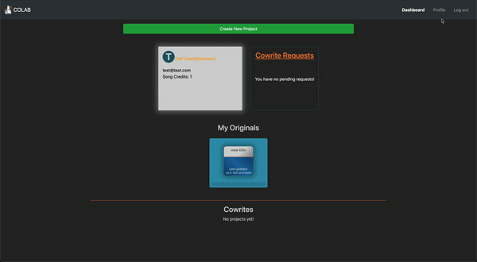

---

### Back end/API

While many features on the front-end utilize third-party APIs, such as the rhyme tool (which utilizes the Datamuse API) and the random quote generator (which utilizes the ZenQuotes API), the back-end functionality was also built from scratch for the sole purpose of controlling Colab's data.

The backend is built using an ExpressJS framework, and utilizes the node-pg library to connect with the PostgreSQL database. The backend is comprised of a CRUD API to store, update, and manage all of the data pertaining to Colab's users, projects, requests, arrangements, and cowrites, and uses RESTful routing conventions.

The direct database manipulation logic is separated from the RESTful routing used to connect the front end with the back end. Each data table also has its own separate file for database manipulation, unit tests, RESTful routing, and integration testing.

#### Running Backend Tests

All unit tests were created using the Jest testing library, with the integration tests utilizing the Supertest library as well. The testing suite currently contains 191 tests in total, which provides roughly 93% coverage over all back-end operations.

To run the testing suite, downlaod the backend code and run `npm install` to install all packages and dependencies from the `package.json` file. Once installed, from the root directory of the backend, run `jest -i` with the optional `--coverage` option to run all tests in order and optionally check the testing coverage. Alternatively, to test one database model or set of routes, navigate to either the `/models` or `/routes` directory, respectively, and run `jest -i __FILENAME__`.

---

### Running the App

To run the app locally on your machine, clone this repository or download the code directly to your machine. From each folder, backend and colab-frontend, run `npm install` to install all necessary packages and dependencies.

MAKE SURE YOU HAVE POSTGRESQL INSTALLED ON YOUR MACHINE BEFORE YOU CONTINUE.

From the backend folder, first seed the database by running `psql < colab.sql`and follow the prompts. Next, run `npm run dev` to start up the development server on `localhost:3001`. From the colab-frontend folder, run 'npm start' to start up the development server on the front end.

**Note** _The ZenQuotes API, which is utilized for the random quote generator, requires an API key to gain full access. If you would like to include this feature, you will need to buy a key from ZenQuotes and place it into a `.env` file to gain access to the full ZenQuotes API feature set_
